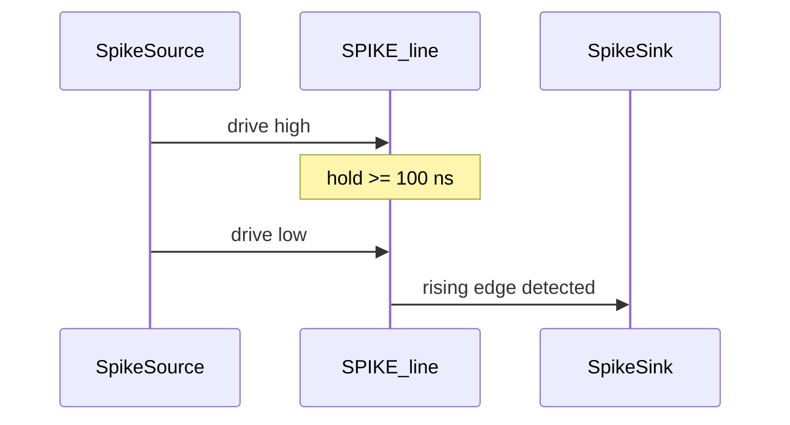
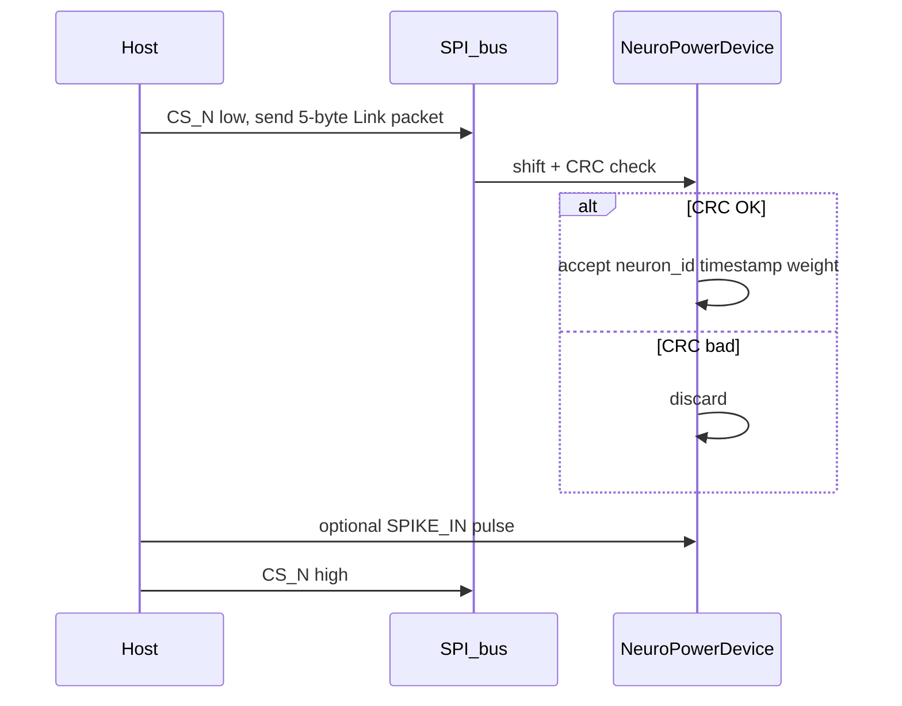
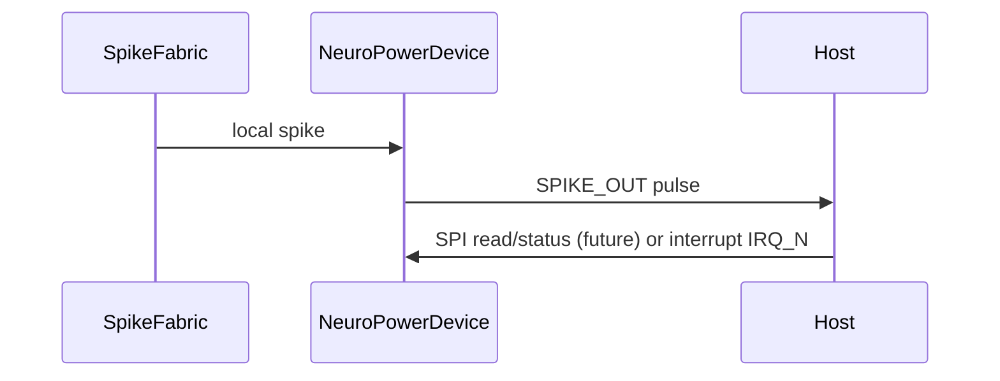

# Spike handshake (Physical + Link)

## Pulse-only view

```mermaid
sequenceDiagram
  participant Src as SpikeSource
  participant Line as SPIKE_line
  participant Dst as SpikeSink
  Src->>Line: drive high
  Note over Line: hold >= 100 ns
  Src->>Line: drive low
  Line->>Dst: rising edge detected
```

## Host-originated event (recommended v0.1.0)

```mermaid
sequenceDiagram
  participant Host
  participant SPI as SPI_bus
  participant Dev as NeuroPowerDevice
  Host->>SPI: CS_N low, send 5-byte Link packet
  SPI->>Dev: shift + CRC check
  alt CRC OK
    Dev->>Dev: accept neuron_id timestamp weight
  else CRC bad
    Dev->>Dev: discard
  end
  Host->>Dev: optional SPIKE_IN pulse
  Host->>SPI: CS_N high
```

## Device-originated spike

```mermaid
sequenceDiagram
  participant Fab as SpikeFabric
  participant Dev as NeuroPowerDevice
  participant Host
  Fab->>Dev: local spike
  Dev->>Host: SPIKE_OUT pulse
  Host->>Dev: SPI read/status (future) or interrupt IRQ_N
```
