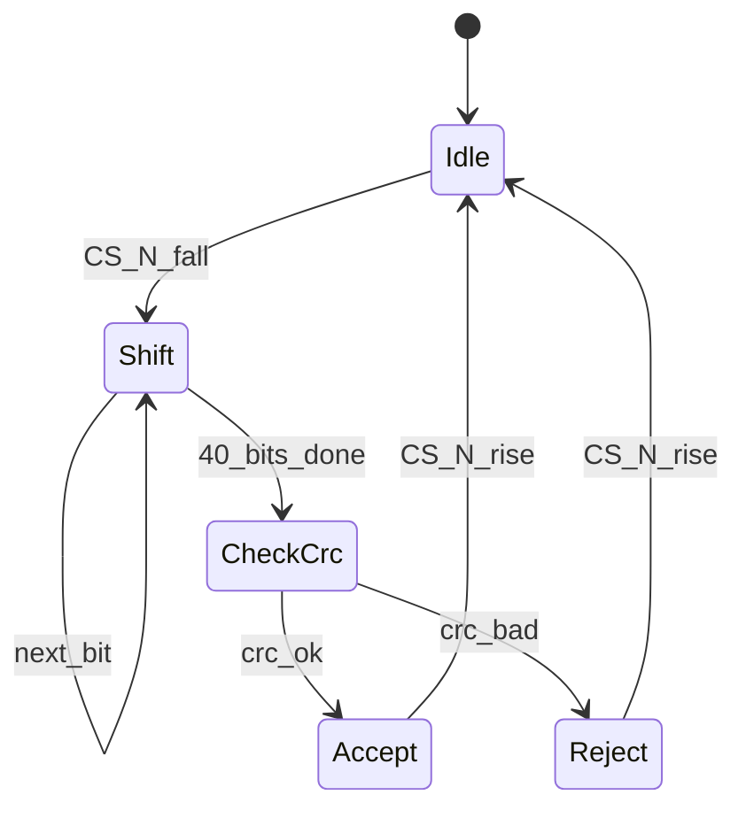

# NeuroPower Protocol — Link Layer v0.1.0

**Status**: Draft  
**Depends on**: [Physical Layer](physical-layer.md)  
**Used by**: Network Layer (TBD), Application API (TBD), RTL `spi_spike_if`

## 1. Overview

The Link Layer frames spike-related control and data over SPI while `CS_N` is asserted. Each **packet** is a fixed 5-octet structure: 4-octet header + 1-octet CRC-8.

Asynchronous `SPIKE_IN` / `SPIKE_OUT` edges indicate event presence; the SPI packet carries identity, timing, and plasticity fields.

## 2. Packet format

Total length: **5 bytes** (40 bits).

```
 Octet 0        Octet 1-2           Octet 3              Octet 4
+-------------+-------------------+--------------------+-------------+
| neuron_id   | timestamp (BE)    | weight_delta|flags | CRC-8       |
| 8 bit       | 16 bit            | 4 bit       |4 bit | 8 bit       |
+-------------+-------------------+--------------------+-------------+
```

| Field | Bits | Position | Description |
|-------|------|----------|-------------|
| `neuron_id` | 8 | octet 0 | Neuron index within core (0–255) |
| `timestamp` | 16 | octets 1–2, **big-endian** | Event time tick (host- or fabric-defined epoch) |
| `weight_delta` | 4 | octet 3 \[7:4\] | Signed nibble for STDP-style update (−8…+7 two’s complement), or absolute delta encoding (see flags) |
| `flags` | 4 | octet 3 \[3:0\] | See §3 |
| `crc8` | 8 | octet 4 | CRC-8 over octets 0–3 |

### 2.1 Bit layout of octet 3

```
 bit:  7 6 5 4 3 2 1 0
      +-------+-------+
      | w_delta | flags |
      +-------+-------+
```

## 3. Flags (octet 3 \[3:0\])

| Bit | Name | Meaning when 1 |
|-----|------|----------------|
| 0 | `DIR_OUT` | Packet describes an outbound (device→host) spike context |
| 1 | `WEIGHT_ABS` | `weight_delta` is magnitude-only; sign in bit 2 |
| 2 | `WEIGHT_NEG` | If `WEIGHT_ABS`, apply negative sign |
| 3 | `CTRL` | Control packet (not a spike event); `neuron_id` may encode opcode |

v0.1.0 reference RTL accepts data packets with `CTRL=0` and verifies CRC.

## 4. CRC-8

- **Polynomial**: 0x07 (x⁸ + x² + x + 1), same family as SMBus CRC-8
- **Init**: 0x00
- **Refin/Refout**: false
- **Xorout**: 0x00
- **Coverage**: octets 0–3 only (not including CRC octet)

### 4.1 Reference algorithm (C-like)

```c
uint8_t np_crc8(const uint8_t *data, size_t len) {
    uint8_t crc = 0x00;
    for (size_t i = 0; i < len; i++) {
        crc ^= data[i];
        for (int b = 0; b < 8; b++) {
            if (crc & 0x80)
                crc = (uint8_t)((crc << 1) ^ 0x07);
            else
                crc <<= 1;
        }
    }
    return crc;
}
```

## 5. Binary examples

### 5.1 Spike event — neuron 0x2A, t=0x0100, Δw=+2, flags=0

Header octets:

| Byte | Value | Meaning |
|------|-------|---------|
| 0 | `0x2A` | neuron_id |
| 1 | `0x01` | timestamp hi |
| 2 | `0x00` | timestamp lo |
| 3 | `0x20` | weight_delta=2, flags=0 |

CRC-8(0x2A,0x01,0x00,0x20) = **`0xD9`**

Full frame (host MOSI order):

```
2A 01 00 20 D9
```

### 5.2 Outbound flag set

Same as above but flags=`DIR_OUT` (bit0): octet3 = `0x21`.  
CRC-8(0x2A,0x01,0x00,0x21) = **`0xDE`**

```
2A 01 00 21 DE
```

## 6. TX / RX state machine (device SPI slave)



While shifting, the device may drive MISO with the previous response byte or `0x00` (v0.1.0: drive `0x00` until a response path exists).

On **Accept**, if `CTRL=0`, assert an internal “packet valid” pulse; optionally pulse `SPIKE_OUT` when the fabric emits a spike (fabric-driven, not required for every RX packet).

## 7. Ordering and concurrency

1. Host may pulse `SPIKE_IN` then send the describing SPI packet, or send the packet first — **v0.1.0 recommends packet then optional pulse** for host-originated events.
2. Overlapping `CS_N` transactions are not allowed; wait `t_IDLE` (Physical Layer).
3. Multi-core routing fields are **out of scope** for Link Layer; see Network Layer.

## 8. Error handling

| Condition | Device behavior |
|-----------|-----------------|
| CRC mismatch | Discard payload; sticky error bit (MMIO, future); optional `IRQ_N` |
| Truncated frame (CS_N rises early) | Discard; treat as error |
| Unknown `CTRL` opcode | Ignore payload (forward compatibility) |

## 9. Compliance checklist (v0.1.0)

- [ ] 5-byte packets, MSB first
- [ ] CRC-8 poly 0x07, init 0
- [ ] Big-endian timestamp
- [ ] Self-checking testbench verifies example §5.1

## 10. Revision history

| Version | Date | Notes |
|---------|------|-------|
| 0.1.0 | 2026-09-08 | Initial Task 1 draft + worked CRC examples |
