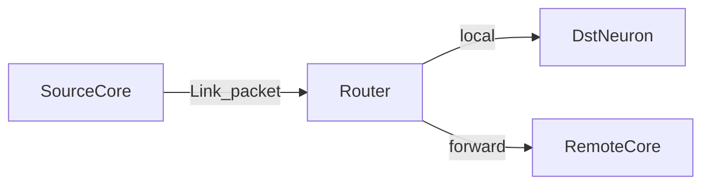

# NeuroPower Protocol — Network Layer v0.1.0

**Status**: Draft (Task 5)  
**Depends on**: [Link Layer](link-layer.md)

## Overview

Routes spike events across multiple NeuroPower cores. Each core hosts up to **256** neurons. A fabric of up to **16** cores yields **4096** addressable neurons.

## Addressing

| Field | Bits | Description |
|-------|------|-------------|
| `core_id` | 4 | 0…15 |
| `neuron_id` | 8 | 0…255 within core |

Global id = `(core_id << 8) | neuron_id`.

## Routing

- Programmable routing table (SRAM): key = global source id → list of local destinations / remote core hops.
- No hardwired mesh topology in v0.1 — reference RTL uses single-core local delivery; multi-core is specified for interoperability.

## Arbitration

- Per-output port: round-robin among pending spike packets.
- Priority flag (Link `flags`) may elevate control packets.

## Congestion

- Drop policy: never drop `CTRL` packets; data spikes may coalesce timestamps under overload (implementation-defined).
- Backpressure via Link layer deferral (hold `SPIKE_OUT` / delay SPI response).

## Compliance (v0.1)

- [ ] Document `core_id` in Link extensions or Network header (future octet)
- [ ] Single-core reference meets local delivery without Network header
- [ ] Multi-core FPGA demo deferred post-v0.1
