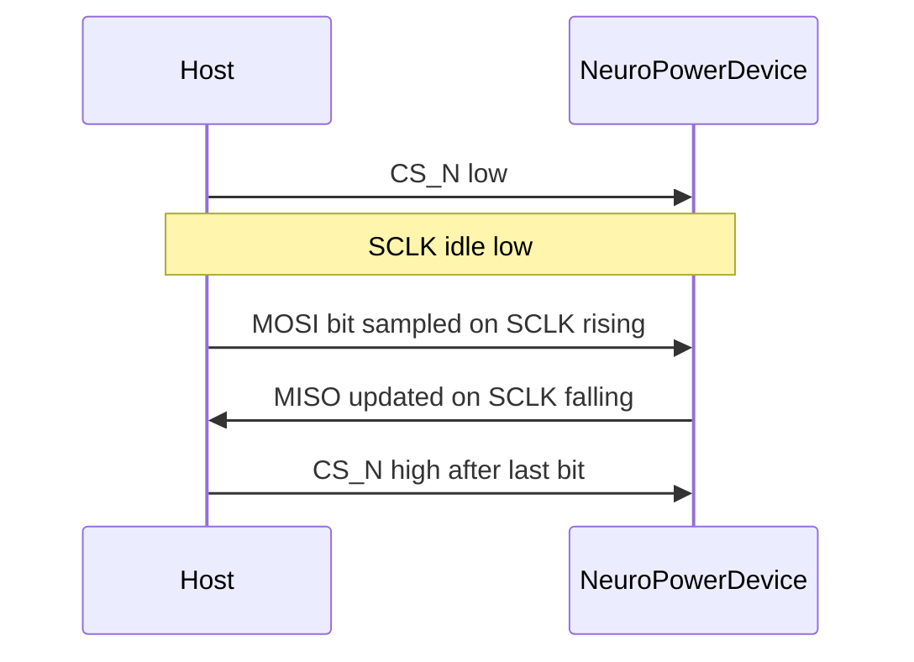
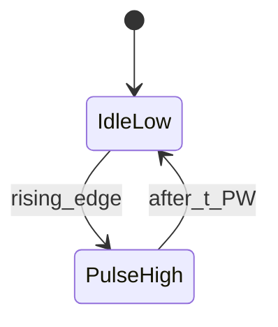

# NeuroPower Protocol — Physical Layer v0.1.0

**Status**: Draft  
**Normative for**: Task 1 reference RTL (`rtl/memory_controller/spi_spike_if.v`)  
**Depends on**: none  
**Used by**: [Link Layer](link-layer.md)

## 1. Overview

The Physical Layer defines electrical signaling between a host MCU (or on-SoC fabric) and a NeuroPower-compliant neuromorphic memory / spike fabric. It extends **SPI Mode 0** with two asynchronous event lines for spike I/O, so hosts up to ~48 MHz GPIO/SPI remain compatible without high-speed SerDes.

Goals:

- Interoperable pinout and timing for wearable-class MCUs
- Event-driven wakeup without keeping a high-rate clock on the spike path
- Enough integrity at the wire for Link Layer CRC-8 (see Link Layer)

## 2. Signal list / pinout

| Signal | Dir (device) | Type | Description |
|--------|--------------|------|-------------|
| `VDD` | power | 1.8 V or 3.3 V | Digital supply (device selects one rail; levels must match host) |
| `VSS` | power | GND | Common ground |
| `SCLK` | in | SPI | Clock, idle low (CPOL=0) |
| `MOSI` | in | SPI | Master-out / slave-in, sample on rising edge (CPHA=0) |
| `MISO` | out | SPI | Master-in / slave-out, change on falling edge |
| `CS_N` | in | SPI | Chip select, active low |
| `SPIKE_IN` | in | async | Rising edge = inbound spike event (pulse) |
| `SPIKE_OUT` | out | async | Rising edge = outbound spike event (pulse) |
| `IRQ_N` | out | OD optional | Active-low interrupt (packet ready / error); may be tied unused |

Optional: `RESET_N` (active low). If omitted, soft reset via Link Layer control packet (future).

### 2.1 SPI base

- **Mode 0**: CPOL = 0, CPHA = 0
- **Max SCLK**: 10 MHz (v0.1.0)
- **Bit order**: MSB first
- **Frame**: full duplex octets while `CS_N` is low; see Link Layer for packet framing

### 2.2 Spike lines

- **Logic**: same VDD family as SPI
- **Polarity**: rising-edge event; idle low
- **Pulse width**: ≥ 2 host GPIO sample periods, recommended ≥ 100 ns
- **Minimum idle between edges**: ≥ 100 ns
- **Glitch**: pulses shorter than 20 ns may be ignored by receivers (implementation-defined filter)

`SPIKE_IN` / `SPIKE_OUT` carry **presence of an event**. Payload (neuron id, timestamp, weight delta) travels on SPI as Link Layer packets, or may be implied by prior configuration (future Network Layer).

## 3. Electrical characteristics (normative targets)

Values are **targets for interoperable hosts**, not silicon characterization.

| Parameter | Min | Typ | Max | Unit | Notes |
|-----------|-----|-----|-----|------|-------|
| VDD (1.8 V class) | 1.62 | 1.80 | 1.98 | V | LVCMOS18-like |
| VDD (3.3 V class) | 2.97 | 3.30 | 3.63 | V | LVCMOS33-like |
| VIH | 0.7×VDD | — | VDD+0.3 | V | |
| VIL | −0.3 | — | 0.3×VDD | V | |
| Input leakage | — | — | ±1 | µA | per pin, powered |
| C_in | — | — | 10 | pF | per signal, excl. connector |

Do not mix 1.8 V device with 3.3 V host without level shifting.

## 4. Timing — SPI Mode 0

Compatible with typical 48 MHz MCU SPI peripherals (with divider to ≤10 MHz).

| Symbol | Parameter | Min | Max | Unit |
|--------|-----------|-----|-----|------|
| f_SCLK | Clock frequency | — | 10 | MHz |
| t_LEAD | CS_N fall to first SCLK rise | 50 | — | ns |
| t_LAG | Last SCLK fall to CS_N rise | 50 | — | ns |
| t_SU | MOSI setup before SCLK rise | 10 | — | ns |
| t_H | MOSI hold after SCLK rise | 10 | — | ns |
| t_V | MISO valid after SCLK fall | — | 30 | ns |
| t_DIS | MISO float after CS_N rise | — | 40 | ns |
| t_IDLE | CS_N high between transactions | 100 | — | ns |

### 4.1 Mermaid timing (conceptual)

See also [diagrams/spi-mode0-timing.md](diagrams/spi-mode0-timing.md) (WaveDrom JSON).

## 5. Timing — spike handshake

Async spike pulse (device or host as source):

| Symbol | Parameter | Min | Max | Unit |
|--------|-----------|-----|-----|------|
| t_PW | Pulse width high | 100 | — | ns |
| t_GAP | Idle low between pulses | 100 | — | ns |
| t_SU_SPI | Spike edge vs. SPI CS (advisory) | — | — | Prefer not to assert `SPIKE_*` while CS_N low unless documented in Link Layer burst mode |

Full handshake with Link Layer ACK flags: [diagrams/spike-handshake.md](diagrams/spike-handshake.md).

## 6. Power modes (physical implications)

| Mode | SPI clocks | Spike lines | Intent |
|------|------------|-------------|--------|
| Active | Allowed ≤10 MHz | Armed | Inference / config |
| Idle listen | SCLK gated | `SPIKE_IN` armed | Wake on event |
| Deep sleep | Floated/held | Maskable | Host wakes via `IRQ_N` or GPIO |

Clock/power gating details: [power-profile.md](power-profile.md) (TBD Task 4/5).

## 7. Compliance checklist (v0.1.0)

- [ ] SPI Mode 0, MSB first, ≤10 MHz
- [ ] `SPIKE_IN` / `SPIKE_OUT` rising-edge pulses ≥100 ns
- [ ] Voltage class documented (1.8 or 3.3)
- [ ] Link Layer packets transferred only while `CS_N` low

## 8. Revision history

| Version | Date | Notes |
|---------|------|-------|
| 0.1.0 | 2026-09-08 | Initial Task 1 draft |
