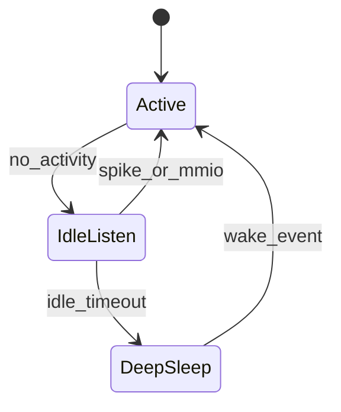

# NeuroPower Protocol — Power Profile v0.1.0

**Status**: Draft (Task 4)  
**Depends on**: [Physical Layer](physical-layer.md)

## Targets

| Metric | Target | Notes |
|--------|--------|-------|
| Peak power | < 1 W | Inference burst |
| Idle listen | < 100 mW | Spike lines armed, clocks partially gated |
| Deep sleep | << 10 mW | Accelerator clock gated |
| Autonomy | ≥ 12 h | 200 mAh cell, ~10% inference duty |

## Modes



RTL: [`rtl/core/power_ctrl.v`](../rtl/core/power_ctrl.v) gates `clk_accel` after `IDLE_CYCLES`.

## Estimation flow

```bash
python sim/power_trace/event_power.py
```

Outputs:

- `sim/power_trace/{always_on,burst,deep_sleep}.csv`
- `sim/power_trace/autonomy_report.json`
- `benchmarks/power/idle_current.csv`
- `benchmarks/power/inference_energy.csv`

These are **model-based** placeholders (no silicon). Replace coefficients when FPGA board measurements exist.

## Recommendations

1. Keep RISC-V and accelerator in separate clock enables.
2. Wake on `SPIKE_IN` / MMIO before starting inference.
3. Prefer INT4 weight reuse in BRAM — avoid re-streaming `.npw` every window.
